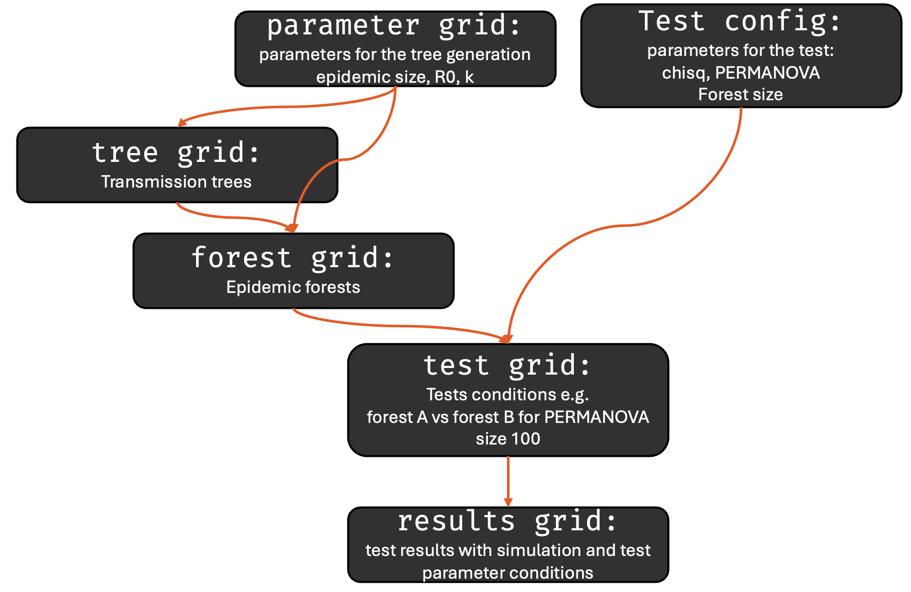

# A statistical framework for comparing epidemic forests

This repository contains code and documentation for the manuscript "A statistical framework for comparing epidemic forest".

## Background

Inferring who infected whom in an outbreak is a complex task but essential for characterising transmission dynamics and guiding public health interventions. Instead of a single definitive transmission tree, epidemiologists often consider multiple plausible trees forming *epidemic forests*. Various inference methods and assumptions can yield different epidemic forests, yet no formal test exists to assess whether these differences are statistically significant. We propose such a framework using a chi-square test and permutational multivariate analysis of variance (PERMANOVA).

## Reproducibility

This project uses `renv` to manage R package dependencies. To set up your environment to match the analysis exactly:

1.  **Clone** this repository.
2.  **Open** the project in RStudio (or set the working directory to the project root in R).
3.  **Restore** the package library by running the following in the R console:
```r
renv::restore()
```

This will download and install all required packages (including specific versions from GitHub and CRAN) recorded in the `renv.lock` file.

The `R` directory contains the two main scripts:

```         
R
├── simulation.R -> forest generation + test results
└── analysis.R -> main results
```

`simulation.R` generates epidemic forests under various simulation parameters and performs the chi-square and PERMANOVA tests. Data is stored in the `data` directory and fully documented in the script. We used a high-performance computing cluster to generate the datasets (`hpc` folder).

`analysis.R` generates the main results and figures for the manuscript. This script will load the existing datasets from the `data` directory.



## Accessibilty

Our framework for comparing collections of graphs using chi-square and PERMANOVA tests is available as a separate R package called `mixtree` available on [CRAN](https://cran.r-project.org/web/packages/mixtree/index.html).

## Contact

Cyril Geismar cgeisma1\@jh.edu